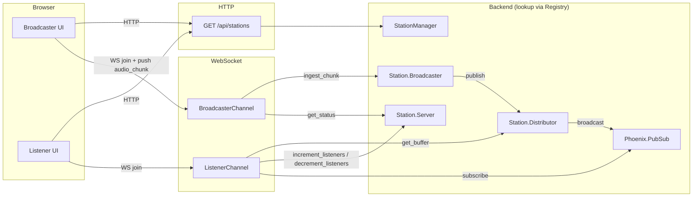

# OTP Radio Architecture

The app runs multiple audio _stations_. Each station is a small OTP tree:

- **Server** – metadata and listener count
- **Broadcaster** – ingests chunks from the broadcaster client
- **Distributor** – PubSub topic and ring buffer for late joiners

The _root_ supervision tree (one per node) has these top-level children:

- **PubSub** – broadcasts audio to listeners
- **Registry** – stations register here by id; used for lookup and to derive the next id
- **StationSupervisor** – DynamicSupervisor that holds 0..N station Supervisors
- **Endpoint** – HTTP and WebSocket

The **StationManager** module is used to register new stations with the Registry and start their Supervisors. It adds new stations to the StationSupervisor under the hood.

## Frontend–Backend Flow

## Fault Tolerance

Supervision strategies determine what happens when a child process crashes. The app uses two strategies to isolate failures and restart only what’s needed.

**OtpRadio.StationSupervisor** is a DynamicSupervisor with strategy `:one_for_one`. Each child is one `Station.Supervisor` (one station’s process tree).

- **When a child crashes:** Only that child is restarted. No other stations are affected.
- **Effect:** A bug or crash in station "3" restarts only station "3". Stations "1", "2", "4", etc. keep running. This gives **fault isolation between stations**.

**OtpRadio.Station.Supervisor** (one per station) is a Supervisor with strategy `:rest_for_one`. Its children are started in order: Server, then Broadcaster, then Distributor.

- **When a child crashes:** That child and every child started **after** it are restarted; children started **before** it stay up.
- **Effect:** Server crash → all three restart; Broadcaster crash → Broadcaster and Distributor restart; Distributor crash → only Distributor restarts. Only processes with downstream dependencies are restarted.

## Audio pipeline (Opus chunks)

Real-time audio is sent over **WebSocket**, not HTTP. The broadcaster’s browser captures the microphone, encodes it as **Opus** (using the MediaRecorder API), and sends the encoded bytes in **chunks**. The server does not decode or re-encode; it stores and forwards those chunks to listeners.

- **Chunk size:** The server accepts chunks between **100 bytes and 100 KB**. Anything smaller or larger is dropped and logged.
- **Sequence and init chunk:** The server assigns a monotonic sequence number to each chunk. Chunk **0** is the **init chunk** (contains Opus decoder config). The server keeps it and sends it first to anyone who joins mid-stream so their decoder can start correctly.
- **Late joiners:** The server keeps a ring buffer of the last **50** chunks per station. When a listener joins, they receive that buffer (init chunk first if present), then live chunks. There is no replay beyond those 50 chunks.

## WebSocket channels

Clients open a WebSocket, then join a channel by subscribing to a topic. All streaming and control goes over that socket as named events.

**Topics.** The broadcaster joins `broadcaster:<station_id>`; the listener joins `listener:<station_id>`. The server fans out audio on an internal topic `station:<station_id>:audio`; clients never join that.

**Broadcaster channel.** The client sends audio in an `audio_chunk` event: the chunk bytes as base64 in a `data` field. The server replies ok or invalid-data. The client can ask for the current listener count with `listener_count`; the server replies with a count.

**Listener channel.** The server pushes each chunk in an `audio` event (base64 data, sequence number, size). New joiners get the recent buffer first, then live chunks; the init chunk (sequence 0) is sent first when present. Join succeeds only if the station exists; otherwise the client gets a reason such as station not found or invalid topic.
