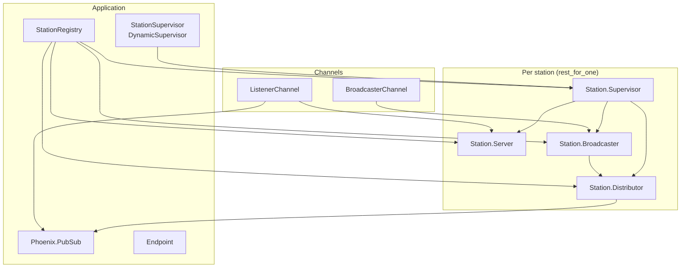

# OTP Radio Architecture

The app runs multiple independent stations. Each station is a small OTP tree: a Server (metadata and listener count), a Broadcaster (ingests chunks from the broadcaster client), and a Distributor (PubSub topic and ring buffer for late joiners). A Registry keys processes by station id so channels can resolve the right Broadcaster or Distributor without passing pids. Stations are started on demand under a DynamicSupervisor; bootstrap creates a few at startup.

## High-level flow

```
Browser (broadcaster)  →  broadcaster:<id> channel  →  Station.Broadcaster
                                                              ↓
                                                    Station.Distributor
                                                              ↓
                                                    PubSub "station:id:audio"
                                                              ↓
Browser (listener)     ←  listener:<id> channel  ←  ListenerChannel (subscribed)
```

Broadcaster client sends base64 Opus chunks. Listener client gets buffered chunks on join, then live chunks over the same socket. Both UIs load stations from `GET /api/stations` (backed by `StationManager.list_stations/0`).

## Component diagram



## Registry

**OtpRadio.StationRegistry** — Unique keys so one process per station per role. Keys: `{:station_supervisor, station_id}`, `{:station_server, station_id}`, `{:station_broadcaster, station_id}`, `{:station_distributor, station_id}`. Channels and StationManager look up by key and call the process via its `via_tuple`.

## StationSupervisor

**DynamicSupervisor** — Starts no children at boot. `StationManager.create_station/2` adds a child spec for `OtpRadio.Station.Supervisor` with `[station_id: id, name: name]`. Strategy `:one_for_one`: one station crash does not restart others.

## Station.Supervisor

**Supervisor** — One per station, registered as `{:station_supervisor, station_id}`. Starts Server, Broadcaster, Distributor in that order. Strategy `:rest_for_one`: if Broadcaster dies, Broadcaster and Distributor restart; Server stays up.

## Station.Server

**GenServer** — Holds station id, display name, listener count. No dependency on Broadcaster or Distributor. Channels call `increment_listeners/1` and `decrement_listeners/1` on join/terminate; broadcaster channel calls `get_status/1` for listener_count replies.

## Station.Broadcaster

**GenServer** — Receives audio chunks from the broadcaster channel, validates size, adds sequence number, and casts to this station’s Distributor. Handles `reset_sequence` so the Distributor buffer is cleared when a new stream starts.

## Station.Distributor

**GenServer** — Publishes each chunk to PubSub topic `station:<id>:audio`. Keeps a ring buffer of recent chunks; on `get_buffer` returns them (with init chunk when sequence 0 exists) so late-joining listeners get catch-up. Listener channel subscribes to the topic and pushes buffered then live chunks to the socket.

## Channels

**BroadcasterChannel** — Topic `broadcaster:<station_id>`. Join looks up `{:station_broadcaster, station_id}`; if missing, join fails. Incoming `audio_chunk` is decoded and sent to that Broadcaster. `listener_count` is a request/reply that reads from Station.Server.

**ListenerChannel** — Topic `listener:<station_id>`. Join looks up station; subscribes to `station:<id>:audio`. On `:after_join`, fetches buffer from Distributor, pushes each chunk, then increments listener count on Server. Receives `{:audio_chunk, chunk}` from PubSub and pushes to socket. On terminate, decrements listener count.

## Bootstrap

**OtpRadio.StationBootstrap** — Called once from Application after the supervision tree is up. Creates a fixed set of stations (e.g. "1" through "4") via `StationManager.create_station/2`. Idempotent for already-existing ids.
