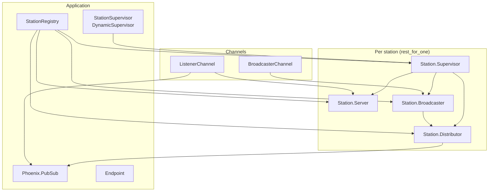

# OTP Radio Architecture

The app runs multiple independent stations. Each station is a small OTP tree:

- **Server** - metadata and listener count
- **Broadcaster** - ingests chunks from the broadcaster client
- **Distributor** PubSub topic and ring buffer for late joiners

A _key registry_ is used so stations can resolve the right Broadcaster or Distributor. Stations are created via `StationManager.create_station/0` (no args); each station gets an auto-incrementing id. The application creates four default stations at startup.

## Audio Data flow

```
Broswer                                             Server

BroadcasterChannel (topic broadcaster:<id>) --->  + Station.Broadcaster
                                                  |
                                                  + Station.Distributor
                                                  |
ListenerChannel (topic listener:<id>)  <--------  + PubSub "station:<id>:audio"
```

## Component diagram



## Registry

**OtpRadio.StationRegistry** — Unique keys so one process per station per role. Keys: `{:station_supervisor, station_id}`, `{:station_server, station_id}`, `{:station_broadcaster, station_id}`, `{:station_distributor, station_id}`. Channels and StationManager look up by key and call the process via its `via_tuple`.

## StationSupervisor

**DynamicSupervisor** — Starts no children at boot. `StationManager.create_station/0` derives the next id from the Registry (max existing numeric station id + 1) and adds a child spec for `OtpRadio.Station.Supervisor` with `[station_id: id, name: id]`. Strategy `:one_for_one`: one station crash does not restart others.

## Station.Supervisor

**Supervisor** — One per station, registered as `{:station_supervisor, station_id}`. Starts Server, Broadcaster, Distributor in that order. Strategy `:rest_for_one`: if Broadcaster dies, Broadcaster and Distributor restart; Server stays up.

## Station.Server

**GenServer** — Holds station id, display name, listener count. No dependency on Broadcaster or Distributor. Channels call `increment_listeners/1` and `decrement_listeners/1` on join/terminate; broadcaster channel calls `get_status/1` for listener_count replies.

## Station.Broadcaster

**GenServer** — Receives audio chunks from the broadcaster channel, validates size, adds sequence number, and casts to this station’s Distributor. Handles `reset_sequence` so the Distributor buffer is cleared when a new stream starts.

## Station.Distributor

**GenServer** — Publishes each chunk to PubSub topic `station:<id>:audio`. Keeps a ring buffer of recent chunks; on `get_buffer` returns them (with init chunk when sequence 0 exists) so late-joining listeners get catch-up. Listener channel subscribes to the topic and pushes buffered then live chunks to the socket.

## Channels

**BroadcasterChannel** — Topic `broadcaster:<station_id>`. Join looks up `{:station_broadcaster, station_id}`; if missing, join fails. Incoming `audio_chunk` is decoded and sent to that Broadcaster. `listener_count` is a request/reply that reads from Station.Server.

**ListenerChannel** — Topic `listener:<station_id>`. Join looks up station; subscribes to `station:<id>:audio`. On `:after_join`, fetches buffer from Distributor, pushes each chunk, then increments listener count on Server. Receives `{:audio_chunk, chunk}` from PubSub and pushes to socket. On terminate, decrements listener count.

## Default stations at startup

After the supervision tree is up, `Application.start/2` calls `StationManager.create_station/0` four times. Each call derives the next id from the Registry (max existing numeric id + 1) and starts a station with that id as both id and display name.
